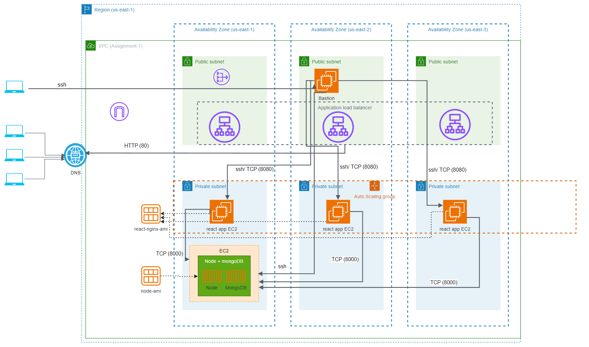

## Cloud Architecture Assignment 1 supplementary repo
This repository serves as a central location of all scripts and other files (where applicable) used to document the architecture of the assignment 1 project and its components

### Architecture diagram

### React-sample-nginx AMI build
Script used for building frontend AMI is available [here](./user-data-react-ami.sh)

### Node-ami build
Script used for building backend AMI is available [here](./user-data-node-ami.sh)

### Node-ami based EC2 launch
Script used for launching node app from the node-ami is available [here](./user-data-node-ami-launch.sh)

### react-sample-nginx AMI build
Script used for launching react app from the react-sample-nginx AMI is available [here](./user-data-react-sample-nginx-launch.sh)